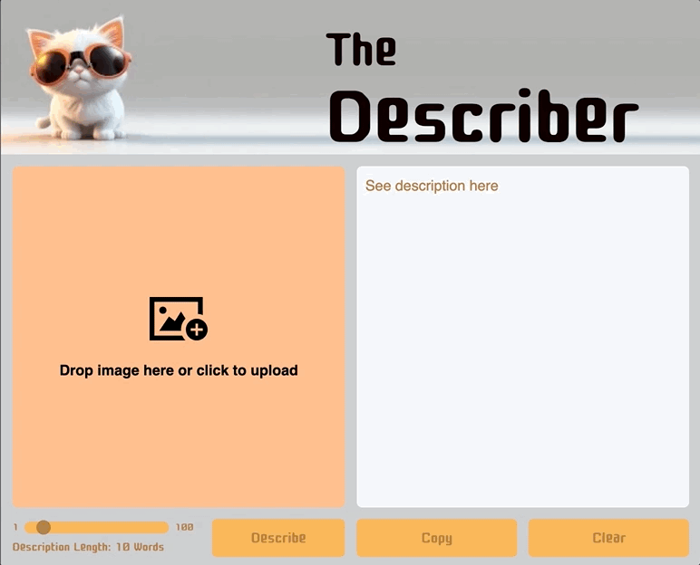

# The Describer
An app to describe an image, powered with Claude AI.

## In This Document:
  - [Live Application URL](#live-application-url)
  - [Repositories](#repositories)
  - [How to Use the Application](#how-to-use-the-application)
  - [Technologies Used](#technologies-used)
  - [Future Features:](#future-features)
  - [Challenges and Learning Points:](#challenges-and-learning-points)

## Live Application URL
[https://thedescriber.pages.dev/](https://thedescriber.pages.dev/)

## Repositories:
1. [Web client repository](https://github.com/shantdashjian/the-describer-client)
2. [Cloudflare worker repository](https://github.com/shantdashjian/the-describer-worker)
   
## How to Use the Application
   
1. The user drags and drops an image or uploads an image file.
2. They choose the description length using the slider.
3. They click on Describe.
4. The description displays.
5. They could copy the text.
6. They could clear and start over.

## Technologies Used
1. HTML, CSS, and JavaScript.
2. Anthropic's Claude AI.
3. Cloudflare for deployment

## Future Features:
1. Adding a Read functionality.

## Challenges and Learning Points:
1. I practiced deploying AI-powered applications to Cloudflare.
2. I limited the CORS origin to the web client for security.
3. I showed different images depending on the screen width using the picture element.
   

[Up](README.md)
